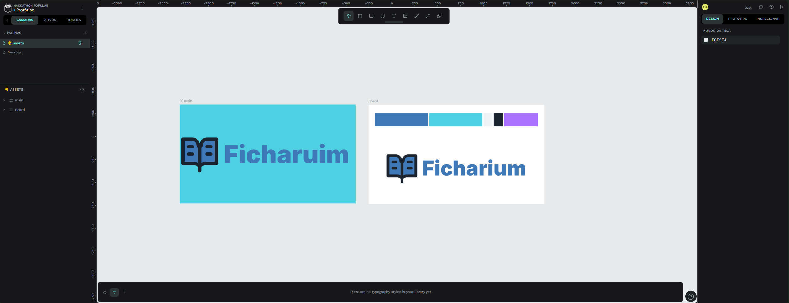

# Ficharium 🗂️

> **Soberania Digital e Tecnologia Popular para Organização Coletiva.**

## 📖 Sobre o Projeto

O **Ficharium** é uma plataforma de código aberto projetada para a **reapropriação tecnológica**. O projeto nasce da necessidade urgente de libertar a organização da classe trabalhadora, coletivos e movimentos sociais das amarras das "Big Techs".

A proposta é unificar a comunicação ágil de comunidades com a profundidade de documentação e gestão de conhecimento, tudo em uma infraestrutura auditável e controlada por quem a utiliza.

---

## 🚩 O Problema: A Dependência Colonial Digital

Atualmente, a **agitação, propaganda e organização popular** dependem de infraestrutura proprietária. Utilizamos ferramentas como Google Workspace, Notion e Discord, que trazem riscos graves:

1.  **Extração de Dados:** Nossas estratégias e conhecimentos são minerados para treinar IAs proprietárias e gerar lucro para terceiros.
2.  **Custo Proibitivo:** Ferramentas essenciais possuem barreiras de pagamento (paywalls) que inviabilizam o uso por coletivos com poucos recursos.
3.  **Risco de Soberania:** Dependemos de servidores estrangeiros que podem encerrar contas unilateralmente ou sofrer sanções políticas.

---

## 💡 A Solução: Uma Ferramenta, Não um Serviço

O **Ficharium** não é uma "nova rede social" onde você cria uma conta e seus dados ficam presos em nossos servidores. **Nós não queremos seus dados.**

Nossa proposta é criar uma **ferramenta de software** (como uma enxada ou um martelo digital) que une o melhor de dois mundos e entrega o controle total para quem a utiliza.

### 🔗 A Junção: "Chat" + "Wiki"
O problema atual é a fragmentação: os grupos discutem no *WhatsApp/Discord* (rápido, mas desorganizado) e documentam no *Drive/Notion* (organizado, mas estático). O Ficharium funde essas experiências:
1.  **Contexto Imediato:** Cada canal de conversa possui, nativamente, abas de documentação, tarefas e arquivos.
2.  **Memória Coletiva:** O que é discutido no chat pode ser transformado em documento estruturado com um clique, sem mudar de plataforma.

### 🏗️ O Modelo: "Você Roda, Você Manda"
Diferente das Big Techs que oferecem o "software como serviço" (SaaS), o Ficharium adota o modelo de **Infraestrutura Soberana**:

* **Auto-Hospedagem Simplificada:** Através do **Docker**, qualquer sindicato, escola, cooperativa ou movimento social pode "rodar" sua própria instância do Ficharium em um computador local, num servidor da organização ou numa rede comunitária.
* **Acessibilidade Real:** O sistema é projetado para ser leve, podendo rodar em hardware modesto (como computadores reaproveitados), permitindo que coletivos com poucos recursos tenham tecnologia de ponta.

---

## 🛡️ Atendendo aos Pilares de Soberania

Este projeto foi desenhado para atender rigorosamente aos requisitos de autonomia tecnológica:

### 🤝 1. Soberania (Controle de Infraestrutura)
O Ficharium é **Docker-first**. A tecnologia é empacotada para que o coletivo tenha a posse real da ferramenta e do banco de dados.

### 🔒 2. Segurança (Proteção de Dados)
Foco em proteção contra vigilância. A arquitetura prevê criptografia para dados sensíveis no banco e tráfego seguro, garantindo um ambiente seguro para articulação política.

### 🎯 3. Controle de Acesso (Contextual)
Implementação de **RBAC (Role-Based Access Control)**. Um militante pode ter acesso de "Leitura" na biblioteca pública, mas acesso de "Gestão" apenas no canal de seu grupo de trabalho, garantindo compartimentalização da informação.

### 📊 4. Auditoria (Transparência)
Diferente das plataformas proprietárias onde o algoritmo é uma caixa preta, o Ficharium preza pela rastreabilidade e transparência do código.

---

## 🛠️ Stack Tecnológica e Viabilidade

O projeto utiliza tecnologias consolidadas, com ampla documentação e comunidade, facilitando a manutenção e a contribuição por outros desenvolvedores brasileiros.

| Camada | Tecnologia | Motivação (Software Livre) |
| :--- | :--- | :--- |
| **Front-end** | **React.js** | Alta modularidade e ecossistema rico para interfaces complexas e responsivas. |
| **Back-end** | **Node.js** | Performance para I/O (chats em tempo real) e facilidade de contribuição (JavaScript). |
| **Banco de Dados** | **PostgreSQL** | Robustez, segurança e suporte nativo a dados relacionais e JSON. |
| **Infraestrutura** | **Docker** | Garante a replicabilidade: roda igual em um servidor caseiro ou na nuvem. |

---

## 🎨 Design e Prototipagem

A interface foi projetada pensando na **acessibilidade para não-técnicos**, reduzindo a curva de aprendizado. Todo o processo de design utilizou ferramentas livres.

> **Ferramenta de Design:** [Penpot](https://penpot.app/) (Alternativa Open Source ao Figma).

> **Brainstorming e Fluxo:**
> 

> **Interface do Usuário (UI):**
> 

---

## 🚀 Roadmap e Visão de Futuro

O Ficharium é um projeto vivo. Nossos próximos passos visam expandir a autonomia:

- [ ] **MVP (Atual):** Criação de Servidores, Canais de Texto e Edição de Documentos Básica.
- [ ] **Sistema de Plugins:** Desenvolver uma arquitetura extensível para que cada organização adapte a ferramenta à sua realidade (ex: plugin de gestão de caixa para cooperativas).
- [ ] **Federação e Integração:** Integração nativa com outras ferramentas livres (como Penpot e Nextcloud) e busca por parcerias com redes de infraestrutura soberana, como a **[Baobáxia](https://www.baobaxia.net/)**, para criar uma rede federada de conhecimento popular.

---

  <strong>Tecnologia desenvolvida pela classe trabalhadora, para a classe trabalhadora.</strong> 
  Construindo a Soberania Digital no Brasil. 🇧🇷 ✊

